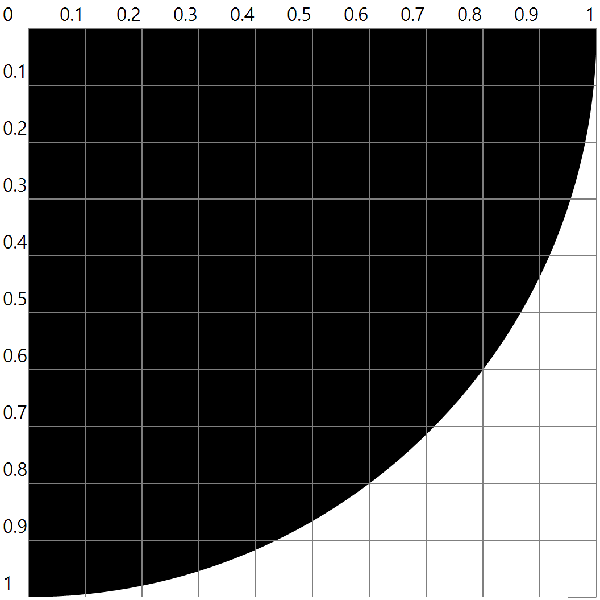

# CalculatePI-using-MonteCarloMethod
몬테카를로 방법(Monte Carlo Method)를 이용한 원주율 파이(π)값 계산

## 0. 그대로 실행 시 주의사항
그대로 실행 시, 하위 디렉토리 ```\imgs``` 를 생성하고 그래픽화한 이미지를 모두 저장하도록 되어 있습니다.
수많은 파일을 생성하고 싶지 않다면, ```Form1.cs``` 에서 ```GetPI```클래스의 ```Next()``` 함수를 수정하세요.

## 1. 몬테카를로 방법 (Monte Carlo Method)
 수치적 알고리즘으로, 랜덤 샘플링을 통해 얻은 데이터를 확률적 계산 방법을 이용하여 원하는 값을 계산하는 알고리즘.
 
## 2. 몬테카를로 방법 적용
**랜덤 샘플링 데이터** : 위치벡터 (x, y) (∵ 0 ≤ x, y ≤ 1)

**원주율을 구하기 위해 사용할 원** : 반지름이 1인 1/4 원



**원주율을 구하기 위한 확률적 방법** : 


